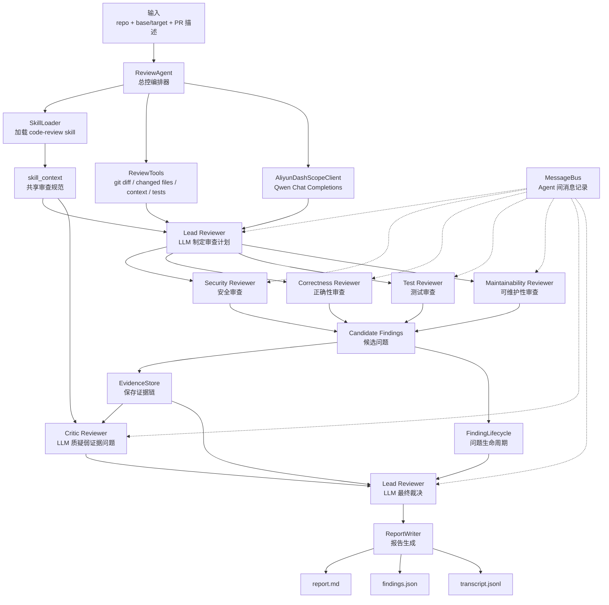

# PR Review Agent Council

一个面向中文学习者和项目展示场景的 **LLM-first 多 Agent PR 代码审查系统**。项目基于 Python 实现，接入阿里云 DashScope / Qwen，并借鉴 `learn-claude-code` 中的 Agent 工程思想，把一次 PR Review 拆成“工具调用、任务规划、多角色审查、反驳质检、最终裁决、可追踪输出”等完整流程。

如果你是第一次看这个项目，建议先读：

- [中文教程：Agent 简历与面试](docs/中文教程-Agent简历面试.md)
- [Demo PR 描述](docs/demo-pr.md)

这个项目适合用于学习和展示以下能力：

- 如何把 LLM 接入真实工程流程，而不是只做一次简单问答。
- 如何设计 Multi-Agent System，让不同 Agent 承担不同审查职责。
- 如何使用 Tool Calling 获取 Git diff、变更文件、测试结果和上下文。
- 如何用 Skill Loading 把审查规范注入到 Agent prompt 中。
- 如何用 EvidenceStore、FindingLifecycle 和 JSONL Trace 让 Agent 输出可解释、可追踪。

## 项目亮点

- **LLM-first 多 Agent 审查**：Lead Reviewer、Security Reviewer、Correctness Reviewer、Test Reviewer、Maintainability Reviewer、Critic Reviewer 都围绕 LLM 推理工作。
- **阿里云 DashScope / Qwen 接入**：通过 OpenAI-compatible Chat Completions API 调用 Qwen 模型，默认模型为 `qwen-turbo-latest`。
- **Claude Code 风格 Agent 工程模式**：借鉴 `learn-claude-code` 的 Tool Calling、Skill、Todo Tracking、Transcript Trace 等思路。
- **Tool Calling**：Agent 不直接“凭空猜”，而是先调用工具收集 Git diff、变更文件、文件上下文、测试输出等信息。
- **Skill Loading**：从 `skills/code-review/SKILL.md` 加载代码审查技能，并注入 Lead、Specialist、Critic、Resolution 等 prompt。
- **Multi-Agent 通信机制**：通过 MessageBus 记录任务分配、候选问题、质疑、辩护和最终裁决。
- **证据链审查**：每个 finding 都绑定 diff line、文件上下文、reviewer rationale、critic challenge 和 lead resolution。
- **Finding Lifecycle**：支持 `candidate -> challenged -> accepted / rejected / downgraded` 的问题生命周期。
- **结构化输出**：要求 LLM 输出 JSON，再经过 schema validation 和 fallback 逻辑处理，便于 CI 或平台集成。
- **可观测性**：所有工具调用、LLM 请求、Agent 消息、证据和裁决都会写入 `.review-agent/transcript.jsonl`。

## 架构流程图



## 工作流程

1. `ReviewAgent` 读取 `.env`、PR 描述、Git diff、变更文件和 `code-review` skill。
2. `Lead Reviewer` 调用 Qwen，基于 PR 信息制定审查计划。
3. `Security / Correctness / Test / Maintainability Reviewers` 分别调用 Qwen，按职责审查代码。
4. 本地规则作为 guardrails 补充，用来捕获硬编码密钥、SQL 拼接、`shell=True`、可变默认参数、吞异常等高置信风险。
5. `EvidenceStore` 为每个候选问题保存 diff 行、文件上下文和 reviewer 解释。
6. `Critic Reviewer` 调用 Qwen 对候选问题进行质疑，过滤证据不足或夸大的 finding。
7. `Lead Reviewer` 再次调用 Qwen，结合证据和 critic 结果做最终裁决。
8. `ReportWriter` 输出 Markdown 报告、结构化 JSON 和 JSONL 运行轨迹。

## 目录结构

```text
agents/review_agent.py              # 核心实现：工具、LLM client、Agent council、报告输出
skills/code-review/SKILL.md         # 代码审查 skill：审查清单、严重级别、finding schema
demo/pr-fixture/payment_risk.py     # 支付风控 Demo PR，包含多类真实审查风险
docs/demo-pr.md                     # Demo PR 描述
docs/中文教程-Agent简历面试.md        # 中文教程、简历写法、面试问答
tests/test_review_agent.py          # 单元测试和集成测试
```

## 环境要求

- Python 3.10 或更高版本。
- Git，用于生成 diff 和读取变更文件。
- 可选：阿里云 DashScope API Key，用于真实调用 Qwen。

项目主程序只使用 Python 标准库；为了运行测试和复现示例，建议安装 `requirements.txt` 中的依赖。

## 快速开始

### 1. 克隆项目

```bash
git clone https://github.com/csy-csy123/pr-review-agent-council.git
cd pr-review-agent-council
```

如果你是在本地已有目录中运行，直接进入项目根目录即可。

### 2. 创建虚拟环境

Windows PowerShell：

```powershell
python -m venv .venv
.\.venv\Scripts\Activate.ps1
```

macOS / Linux：

```bash
python3 -m venv .venv
source .venv/bin/activate
```

### 3. 安装依赖

```bash
python -m pip install -U pip
python -m pip install -r requirements.txt
```

说明：当前项目运行时代码只依赖 Python 标准库，`requirements.txt` 主要用于安装 `pytest`，方便运行测试和验证项目。

### 4. 配置 DashScope

在项目根目录创建 `.env`，可以参考 `.env.example`：

```text
DASHSCOPE_API_KEY=your_dashscope_api_key
```

程序启动时会自动读取 `.env`，然后创建 Qwen LLM client。

如果暂时没有 API Key，也可以使用 `--llm-provider none` 先跑本地规则版本。

### 5. 运行测试

```bash
python -m pytest -p no:cacheprovider
```

### 6. 运行 Agent 审查

运行完整的 Qwen 多 Agent 审查：

```bash
python agents/review_agent.py --repo . --base HEAD~1 --target HEAD --pr-description docs/demo-pr.md --language zh --llm-provider aliyun
```

只运行本地确定性规则，不调用 LLM：

```bash
python agents/review_agent.py --repo . --base HEAD~1 --target HEAD --pr-description docs/demo-pr.md --language zh --llm-provider none
```

## 常用参数

```text
--repo              要审查的本地仓库路径
--base              对比基线，例如 HEAD~1 或 main
--target            目标版本，例如 HEAD 或 feature branch
--pr-description    PR 描述文件，可选
--test-command      测试命令，可选，例如 "python -m pytest"
--language          报告语言：zh 或 en
--mode              执行模式：council 或 simple
--critic-pass       是否启用 critic review：true 或 false
--llm-provider      LLM provider：aliyun 或 none
--llm-model         DashScope 模型名，默认 qwen-turbo-latest
--llm-base-url      OpenAI-compatible DashScope base URL
```

## 输出结果

```text
.review-agent/report.md        # 面向人阅读的审查报告
.review-agent/findings.json    # 结构化 findings，可用于 CI 或平台集成
.review-agent/transcript.jsonl # Agent 运行轨迹：工具、LLM、消息、证据、生命周期
```

最终 verdict 根据 accepted findings 生成：

```text
approve          没有需要处理的问题
comment          只有 P2/P3 问题
request_changes  存在 P0/P1 问题
```

## 如何确认真的调用了 LLM

运行后查看 transcript：

```powershell
Select-String -Path .review-agent\transcript.jsonl -Pattern "llm.request","llm.response","llm.error","llm.skipped"
```

完整的 LLM council run 通常会包含：

```text
lead-reviewer.plan
security-reviewer
correctness-reviewer
test-reviewer
maintainability-reviewer
critic-reviewer
lead-reviewer.resolve
```

如果看到 `llm.skipped`，通常说明没有配置 API key，或者运行时选择了 `--llm-provider none`。

## Demo 场景

`demo/pr-fixture/payment_risk.py` 模拟一个支付风控 PR，故意放入了多类需要审查的问题：

- 硬编码 API token 和 webhook secret。
- SQL 字符串拼接。
- 不安全的 shell 执行。
- trusted merchant 绕过风控。
- 高风险国家处理逻辑过弱。
- webhook 签名不匹配时仍然接受事件。
- 内存态幂等记录，不适合生产环境。
- 退款逻辑缺少原交易校验。
- 敏感信息日志输出。
- 可变默认参数和吞异常。
- 缺少覆盖生产行为变化的测试。

## 与 learn-claude-code 的关系

本项目不是 Claude Code 的直接依赖，而是基于 `learn-claude-code` 的 Agent 学习思路做的二次改造和项目化实现。核心目标是把“Claude Code 风格的 Agent 工程能力”迁移到一个可以本地运行、可以调用 Qwen、可以用于简历展示的 PR Review Agent 系统中。

对应关系包括：

- Tool Calling：通过工具收集 Git diff、文件上下文、测试结果。
- Skill：通过 `skills/code-review/SKILL.md` 注入代码审查规范。
- Todo / Planning：Lead Reviewer 先制定多角色审查计划。
- MAS：多个 Reviewer Agent 分工协作。
- Agent Communication：MessageBus 记录 Agent 之间的任务、finding、challenge、resolution。
- Transcript：使用 JSONL 记录完整执行轨迹，便于复盘和调试。

## 技术关键词

Python, Aliyun DashScope, Qwen, OpenAI-compatible Chat Completions, LLM Agent, Multi-Agent System, Tool Calling, Skill Loading, Todo Tracking, MessageBus, Agent Communication, EvidenceStore, FindingLifecycle, Critic Agent, Lead Agent Planning, Structured Output, JSON Schema Validation, JSONL Trace, Git Diff Analysis, pytest

## 简历写法参考

基于 Python 和阿里云 DashScope/Qwen 构建 LLM-first 多 Agent PR 审查系统，借鉴 learn-claude-code 的 Agent 工程模式，实现 Tool Calling、Skill Loading、MessageBus、EvidenceStore、FindingLifecycle、Critic Agent 和 JSONL Trace，使代码审查结果具备可解释、可追踪、可集成的工程能力。
