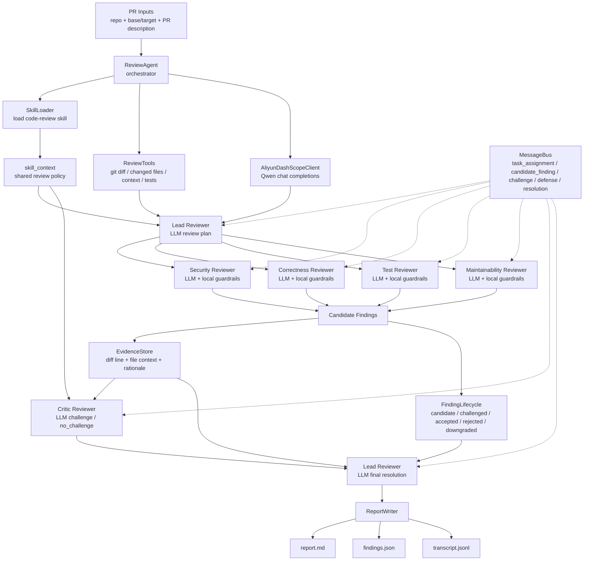

# PR Review Agent Council

PR Review Agent Council 是一个基于 **Aliyun DashScope / Qwen** 的 LLM-first 多 Agent PR 代码审查系统。项目基于 `learn-claude-code` 的 Agent 工程练习范式扩展而来，将 Tool Calling、Skill Loading、Todo Tracking、MessageBus、EvidenceStore、FindingLifecycle、Structured Output 和 JSONL Trace 应用于 PR Review 场景。

系统输入 Git diff、PR 描述和可选测试命令，自动组织多个 LLM Agent 完成审查计划、专项审查、证据绑定、反向质疑、最终裁决和报告生成。

## Highlights

- **LLM-first Multi-Agent Review**：Lead、Security、Correctness、Test、Maintainability、Critic 多角色协作。
- **Qwen / DashScope Integration**：通过 OpenAI-compatible Chat Completions API 调用 `qwen-turbo-latest`。
- **Claude Code-style Agent Patterns**：参考 `learn-claude-code` 中的工具化、技能加载、任务追踪和 transcript 思路。
- **Tool Calling**：将 Git diff、变更文件、源码上下文、测试执行和 secret scan 封装为受控工具。
- **Skill Loading**：将 `skills/code-review/SKILL.md` 作为共享审查规范注入 Lead、Specialist、Critic 和 Lead Resolution 全链路 prompt。
- **Agent Communication**：通过 MessageBus 记录任务分配、候选问题、质疑、答辩和裁决。
- **Evidence-based Findings**：通过 EvidenceStore 为每个 finding 绑定 diff line、file context、critic review 和 lead resolution。
- **Finding Lifecycle**：管理 `candidate -> challenged -> accepted / rejected / downgraded` 状态流转。
- **Structured Output**：要求 LLM 返回 JSON，并通过 schema validation 过滤无效输出。
- **Observability**：通过 JSONL transcript 记录工具调用、LLM 调用、Agent 消息和状态变化。

## Architecture



## Agent Workflow

1. `ReviewAgent` loads `.env`, `code-review` skill, PR description, changed files and Git diff.
2. `Lead Reviewer` calls Qwen to generate a role-specific review plan.
3. `Security / Correctness / Test / Maintainability Reviewers` call Qwen with role-specific system prompts, lead focus, skill context and diff evidence.
4. Local deterministic guardrails run after LLM review to catch high-confidence patterns such as hardcoded secrets, SQL interpolation, `shell=True`, mutable defaults and swallowed exceptions.
5. `EvidenceStore` binds reviewer explanation, diff line and source context to each candidate finding.
6. `Critic Reviewer` calls Qwen to challenge weak, overstated or unsupported findings.
7. `Lead Reviewer` calls Qwen again to resolve each finding as `accepted`, `rejected` or `downgraded`.
8. `ReportWriter` writes Markdown, JSON and JSONL outputs.

## Repository Layout

```text
agents/review_agent.py              # Core implementation: tools, LLM client, agent council, reports
skills/code-review/SKILL.md         # Shared review skill: checklist, severity/category, finding schema
demo/pr-fixture/payment_risk.py     # Payment-risk demo PR with realistic review issues
docs/demo-pr.md                     # Demo PR description
docs/中文教程-Agent简历面试.md      # Chinese tutorial, resume wording, interview Q&A
tests/test_review_agent.py          # Unit and integration tests
```

## Quick Start

### 1. Run Tests

```powershell
cd D:\pr-review-agent-council
D:\envs\mind\python.exe -m pytest -p no:cacheprovider
```

### 2. Configure DashScope

Create a `.env` file in the repository root:

```text
DASHSCOPE_API_KEY=your_dashscope_api_key
```

The application loads this file automatically before building the LLM client.

### 3. Run the Review Agent

Run the full Qwen-powered council:

```powershell
D:\envs\mind\python.exe agents\review_agent.py --repo . --base HEAD~1 --target HEAD --pr-description docs\demo-pr.md --language zh --llm-provider aliyun
```

Run local deterministic review only:

```powershell
D:\envs\mind\python.exe agents\review_agent.py --repo . --base HEAD~1 --target HEAD --pr-description docs\demo-pr.md --language zh --llm-provider none
```

## CLI Options

```text
--repo              Local repository path to review
--base              Base revision or branch, for example HEAD~1 or main
--target            Target revision or branch, for example HEAD or feature branch
--pr-description    Optional PR description markdown file
--test-command      Optional test command, for example "python -m pytest"
--language          Report language: zh or en
--mode              Execution mode: council or simple
--critic-pass       Enable critic review: true or false
--llm-provider      LLM provider: aliyun or none
--llm-model         DashScope model name, default qwen-turbo-latest
--llm-base-url      OpenAI-compatible DashScope base URL
```

## Outputs

```text
.review-agent/report.md        # Human-readable review report
.review-agent/findings.json    # Structured findings for CI or platform integration
.review-agent/transcript.jsonl # Agent trace: tools, LLM calls, messages, evidence and lifecycle events
```

The verdict is derived from accepted findings:

```text
approve          No actionable findings
comment          Only P2/P3 findings
request_changes  At least one P0/P1 finding
```

## Verifying LLM Calls

Inspect the transcript:

```powershell
Select-String -Path .review-agent\transcript.jsonl -Pattern "llm.request","llm.response","llm.error","llm.skipped"
```

A complete LLM council run should include:

```text
lead-reviewer.plan
security-reviewer
correctness-reviewer
test-reviewer
maintainability-reviewer
critic-reviewer
lead-reviewer.resolve
```

## Demo Scenario

`demo/pr-fixture/payment_risk.py` simulates a payment-risk PR. It intentionally includes issues that require both deterministic checks and semantic review:

- Hardcoded API token and webhook secret.
- SQL query interpolation.
- Unsafe shell execution.
- Trusted merchant bypass.
- Weak high-risk-country handling.
- Webhook signature mismatch that still accepts events.
- In-memory idempotency state.
- Refund handling without original transaction validation.
- Sensitive logging.
- Mutable default arguments and swallowed exceptions.
- Missing tests for production behavior changes.

## Relationship to learn-claude-code

This project is inspired by `learn-claude-code` rather than a direct dependency on Claude Code. It applies similar Agent engineering patterns to a Qwen-based local PR review system:

- Tool registry and tool handlers.
- Skill-based domain instruction loading.
- Todo-style task state tracking.
- Transcript-first observability.
- Structured findings and schema validation.
- Multi-agent delegation and review council workflow.

## Technology Keywords

Python, Aliyun DashScope, Qwen, OpenAI-compatible Chat Completions, LLM Agent, Multi-Agent System, Tool Calling, Skill Loading, Todo Tracking, MessageBus, Agent Communication, EvidenceStore, FindingLifecycle, Critic Agent, Lead Agent Planning, Structured Output, JSON Schema Validation, JSONL Trace, Git Diff Analysis, pytest

## Resume Summary

Built an LLM-first Multi-Agent PR Review Council based on Python and Aliyun DashScope/Qwen, inspired by learn-claude-code Agent engineering patterns. Implemented Tool Calling, Skill Loading, MessageBus, EvidenceStore, FindingLifecycle, Critic Agent and JSONL Trace to produce explainable, auditable and CI-friendly PR risk reviews.
