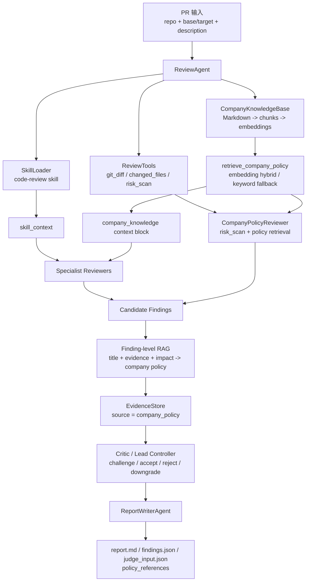
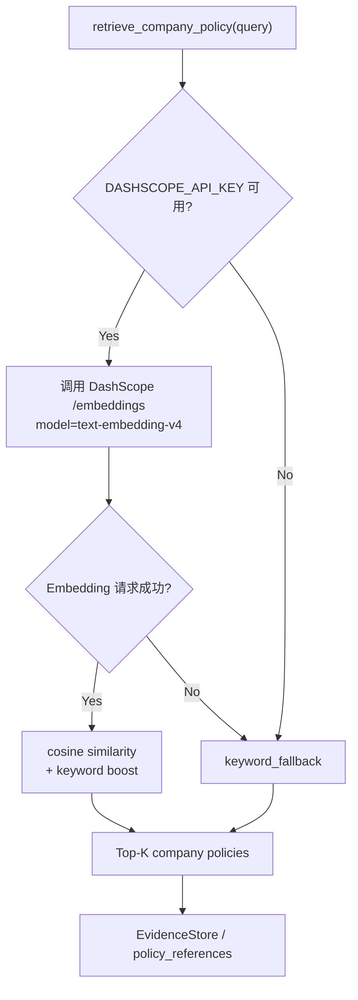

# Company Knowledge RAG Alignment

本页说明新版本的 **公司知识对齐 RAG**：它不是把公司规范简单塞进 prompt，而是把公司私有规范作为可检索知识源，参与 reviewer 生成、finding 补证、policy reviewer 主动发现和最终报告引用。

## 设计目标

- **对齐公司规范**：让审查结论能引用内部安全基线、支付规范、测试要求和历史事故案例。
- **减少主观判断**：把“模型觉得有风险”升级为“代码证据 + 公司规范依据”。
- **支持对比实验**：可以用 `--disable-company-rag` 关闭 RAG，观察报告证据质量和 policy citation 的变化。
- **保持可复现**：默认使用本地 Markdown 知识库；有 `DASHSCOPE_API_KEY` 时使用 DashScope embedding，无 key 时自动退化到关键词检索。

## 知识库结构

默认目录：

```text
knowledge/company/
  security_baseline.md       # SQL 参数化、命令执行、密钥管理、敏感日志
  payment_review_policy.md   # webhook 验签、幂等、风控 fail-closed
  testing_policy.md          # 支付/安全/风控变更的测试要求
  incident_cases.md          # 历史缺陷案例和修复经验
```

每个 Markdown 文件按标题切成 chunk。检索结果包含：

```json
{
  "policy_id": "payment_review_policy:webhook-signature-verification",
  "doc_path": "payment_review_policy.md",
  "heading": "Webhook Signature Verification",
  "excerpt": "Payment webhooks must verify signatures...",
  "score": 0.82,
  "retrieval_method": "embedding_hybrid"
}
```

## RAG 加在哪



### 1. Prompt 上下文层

Review 开始前，系统会根据 PR description、changed files 和 diff 检索相关公司规范，并追加到：

```text
<company_knowledge>
...
</company_knowledge>
```

这让 reviewer 在生成 finding 前就能参考公司内部规范。

### 2. Finding 证据增强层

每个 candidate finding 生成后，系统会用：

```text
title + category + evidence + impact + suggestion
```

再次检索公司规范，并写入 evidence chain：

```json
{
  "source": "company_policy",
  "added_by": "company-rag",
  "content": "PAY-WEBHOOK-001 ..."
}
```

这样 Critic、Lead Controller 和 ReportWriter 都能看到规范依据。

### 3. Company Policy Reviewer 发现层

新增 `company-policy-reviewer`，用于主动发现公司规范违规。

它的逻辑是：

```text
risk_scan 抽取风险信号
        ↓
retrieve_company_policy 检索相关公司规范
        ↓
生成 policy violation finding
        ↓
进入 Debate / Council 的质疑、补证、裁决流程
```

因此 RAG 不只是 “RAG as evidence”，也承担 “RAG as reviewer”。

## Embedding 与降级



索引缓存默认写入：

```text
.review-agent/company_knowledge_index.json
```

缓存会根据知识库内容 hash、embedding model 和 dimensions 判断是否需要重建。

## 常用命令

默认启用公司知识 RAG：

```bash
python agents/review_agent.py --repo . --base HEAD~1 --target HEAD --pr-description docs/demo-pr.md --language zh --mode debate
```

指定知识库目录：

```bash
python agents/review_agent.py --repo . --base HEAD~1 --target HEAD --company-knowledge-dir knowledge/company
```

指定 embedding 参数：

```bash
python agents/review_agent.py --repo . --base HEAD~1 --target HEAD --embedding-model text-embedding-v4 --embedding-dimensions 1024
```

关闭 RAG 做对比：

```bash
python agents/review_agent.py --repo . --base HEAD~1 --target HEAD --disable-company-rag
```

无 API key 的离线演示：

```bash
python agents/review_agent.py --repo . --base HEAD~1 --target HEAD --mode debate --llm-provider none
```

无 key 时 review 仍可运行，RAG 会标记为 `keyword_fallback`。

## 输出变化

`findings.json` 中的 candidate 会包含公司规范证据：

```json
{
  "source": "company_policy",
  "content": "payment_review_policy:webhook-signature-verification ..."
}
```

`judge_input.json` 和标准化报告会包含：

```json
{
  "policy_references": [
    "payment_review_policy:webhook-signature-verification ..."
  ]
}
```

## 面试讲法

如果要写进简历或 GitHub 项目亮点，可以参考 [resume-company-rag-update.md](resume-company-rag-update.md)。

可以这样解释：

> 我把 RAG 加在三层：第一，review 前检索相关公司规范注入上下文；第二，finding 生成后再检索规范作为 `company_policy` 证据；第三，新增 `company-policy-reviewer`，让 RAG 能主动发现违反公司内部规范的问题。这样系统不只是通用代码审查，而是能对齐企业私有规范和历史事故经验的 PR Review Agent。

也可以补充边界：

> 这版的本地 fallback 仍依赖 `risk_scan` 抽取风险信号，所以不是任意公司规范都能自动发现。后续可以把 `company-policy-reviewer` 升级为 policy-to-checklist planner，让它从规范自动生成检查项。
