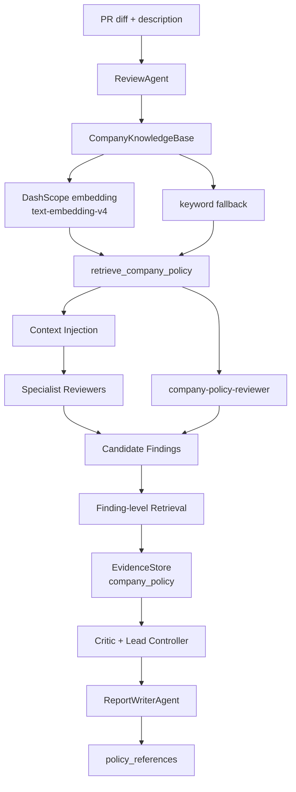

# 简历补充：公司知识 RAG 对齐版

这份文档用于把新版 `Company Knowledge RAG + company-policy-reviewer` 写进简历、GitHub 项目说明和面试回答里。建议作为现有 `Agent开发岗简历写法.md` 的补充材料使用。

## 适合投递方向

- AI 应用开发实习
- LLM Agent / RAG 应用开发
- 企业 AI 中台 / 内部提效工具
- 代码智能、研发效能、AI Review、AI Governance 相关岗位

## 项目定位升级

原来的项目重点是：

> 多 Agent Debate Council 代码审查系统，强调 Reviewer、Critic、Lead Controller、ReportWriterAgent、AI Judge 的协作流程。

新版可以升级为：

> 面向企业规范对齐的多 Agent PR Review 系统，在通用代码审查能力之外，引入公司知识 RAG 和 company-policy-reviewer，让审查结论能引用企业安全基线、支付规范、测试策略和历史事故案例。

这个变化非常适合 AI 应用开发岗位，因为它不只是“会调大模型”，而是体现了业务落地里的三个关键词：私有知识库、RAG 对齐、Agent 流程治理。

## 简历项目名

推荐写法：

**PR Review Agent Council：企业规范对齐的多 Agent 代码审查系统**

如果简历空间很紧，可以写：

**PR Review Agent Council：Multi-Agent + RAG 代码审查系统**

## 简历项目描述

完整版：

- 基于 Python + Qwen/DashScope 构建多 Agent PR Review 系统，将代码审查拆解为 Security、Correctness、Test、Maintainability、CompanyPolicy Reviewer，以及 Critic、Lead Controller、ReportWriterAgent 和 AI Judge 等角色。
- 设计公司知识 RAG 模块，将安全基线、支付审核规范、测试策略和历史事故案例按 Markdown 标题切分为 chunks，调用 DashScope OpenAI-compatible `text-embedding-v4` 生成向量索引，并结合 cosine similarity 与关键词兜底完成混合检索。
- 新增 `company-policy-reviewer`，基于 `risk_scan + retrieve_company_policy` 主动发现 SQL 参数化、webhook 验签、敏感日志、支付 fail-closed、测试缺失等违反公司规范的问题，避免只对已有 finding 做事后补证。
- 将命中的公司规范写入 `EvidenceStore`，source 标记为 `company_policy`，并在标准化报告与 `judge_input.json` 中输出 `policy_references`，使 Critic、Lead Controller 和 AI Judge 能基于企业规范进行质疑、裁决和评估。
- 支持 `--disable-company-rag` 做消融对比；无 `DASHSCOPE_API_KEY` 或 embedding 请求失败时自动退化为 `keyword_fallback`，保证本地 demo 和 GitHub 展示可复现。

精简版：

- 构建 Multi-Agent PR Review 系统，引入公司知识 RAG，将安全基线、支付规范、测试策略和历史事故案例检索为 `company_policy` 证据，辅助 Reviewer、Critic 与 Lead Controller 做企业规范对齐的审查决策。
- 新增 `company-policy-reviewer` 主动发现公司规范违规，并通过 DashScope `text-embedding-v4` + 关键词兜底实现混合检索、索引缓存和离线降级，提升项目在私有知识库和 AI 应用治理场景下的落地性。

## 简历关键词

`LLM Agent`、`Multi-Agent Debate`、`RAG`、`Embedding`、`DashScope`、`text-embedding-v4`、`Hybrid Retrieval`、`Company Policy Alignment`、`Evidence Chain`、`AI Governance`、`Prompt Optimization`、`LLM-as-Judge`、`Harness Evaluation`

## 面试一句话介绍

我这个项目不是简单把 PR diff 丢给大模型，而是把代码审查拆成多个 Agent 协作，并在新版里加入了公司知识 RAG：系统会从安全基线、支付规范、测试策略和历史事故案例中检索相关条款，把它们作为 `company_policy` 证据注入 finding；同时新增 `company-policy-reviewer`，让系统能主动发现违反企业规范的问题，而不是只给已有 finding 做引用补充。

## RAG 加在哪里

可以回答成三层：

1. 上下文层：review 开始前，根据 PR diff 和描述检索相关公司规范，注入 `<company_knowledge>`，让 reviewer 在生成 finding 前就看到企业约束。
2. 证据层：candidate finding 生成后，用 finding 的 title、evidence、impact、suggestion 再检索公司规范，把命中条款写入 evidence chain，source 为 `company_policy`。
3. 发现层：新增 `company-policy-reviewer`，用 `risk_scan + retrieve_company_policy` 主动生成公司规范违规 finding，解决“不在已有 finding 里就无法挂 RAG”的问题。

## 为什么不是只用 Skill

可以这样答：

> Skill 更适合沉淀通用审查方法，比如怎么检查安全、正确性、测试和可维护性；但公司规范和历史事故会经常变化，而且内容更像私有知识库，不适合全部写死进 prompt。RAG 的作用是把公司安全基线、支付规范、测试要求和历史事故案例按需检索出来，作为可追溯的证据。两者不是替代关系：Skill 负责通用方法论，RAG 负责企业私有知识对齐。

## 如果公司规范违规不在 finding 里怎么办

这是新版最重要的改进点：

> 早期设计只是在已有 finding 后面挂公司规范证据，这确实会漏掉“模型没有先发现”的公司规范违规。所以我新增了 `company-policy-reviewer`。它不是等别人提出 finding，而是主动调用 `risk_scan` 找风险信号，再调用 `retrieve_company_policy` 检索相关规范，最后生成新的 policy finding。这样 RAG 从事后补证升级成了主动审查能力。

注意边界也要说清楚：

> 当前版本的主动发现仍依赖已有的风险扫描信号，不能保证覆盖任意公司规范。后续可以把公司规范反向生成 checklist 或 harness rule，让 policy-to-checklist planner 自动扩展检查项。

## 有效性怎么证明

不要只说“加了 RAG 更好”，建议说指标：

- Policy citation rate：高风险 finding 中有多少挂上了 `company_policy` 证据。
- Policy precision：命中的规范是否真的和 finding 相关。
- Discovery gain：`company-policy-reviewer` 相比关闭 RAG 时多发现了哪些公司规范违规。
- Severity alignment：有公司规范依据后，severity 是否更符合企业标准。
- Ablation：用 `--disable-company-rag` 关闭 RAG，对比报告中的 `company_policy`、`policy_references` 和 AI Judge 评分变化。

面试回答：

> 我没有把 RAG 的有效性只定义成“分数更高”，而是拆成引用率、引用准确率、主动发现增益和严重级别对齐。项目里也保留了 `--disable-company-rag`，可以做消融实验，比较开启和关闭公司知识库时报告证据链和 judge_input 的变化。

## GitHub 展示建议

README 里建议重点展示这几件事：

- `knowledge/company/` 示例知识库，说明不是只写规则，而是模拟企业内部知识库。
- `retrieve_company_policy` 工具，说明 Agent 可以通过 tool 调用公司规范检索。
- `company-policy-reviewer`，说明 RAG 不只是事后引用，还参与主动发现。
- `policy_references`，说明最终报告和 AI Judge 输入可以追踪规范依据。
- `keyword_fallback`，说明无 embedding key 时仍可本地复现。

## 不建议夸大的说法

避免写：

- “完全自动理解所有公司规范”
- “可以替代人工 Code Review”
- “RAG 保证审查结果正确”
- “已经实现企业级知识库平台”

更稳的说法：

> 当前版本实现了一个轻量级企业规范对齐原型，重点展示从私有知识库检索、Agent 工具调用、证据链注入到标准化评估的完整闭环。

