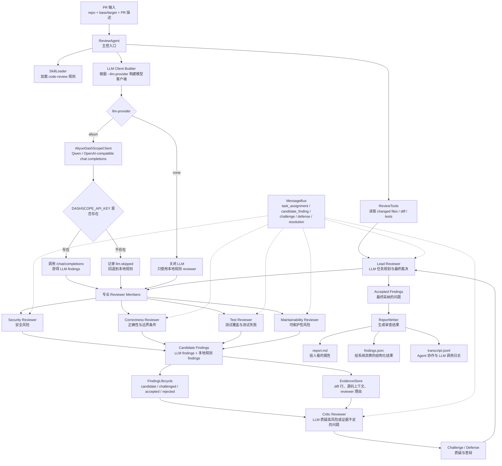

# PR Review Agent Council 中文教程、简历写法与面试问答

## 1. 项目一句话介绍

这个项目是一个本地可运行的 LLM-first 多 Agent PR 代码审查系统。它读取 Git diff 和 PR 描述后，先由 Lead Reviewer 调用阿里云 DashScope/Qwen 生成审查计划，再调度 Security、Correctness、Test、Maintainability 四个专业 reviewer 分角色审查；之后 Critic Reviewer 也会调用 Qwen 质疑高风险或证据不足的问题，最后 Lead Reviewer 再调用 Qwen 做 accepted/rejected/downgraded 最终裁决。系统同时保留本地规则 reviewer 作为确定性兜底，并输出 Markdown 报告、JSON findings 和 JSONL 协作日志。

适合在简历和面试中包装成：

```text
基于阿里云 Qwen 与本地规则兜底的多 Agent PR 风险审查系统。
```

## 2. 项目解决什么问题

传统 PR review 有几个痛点：

- reviewer 容易漏掉安全、边界条件、测试覆盖等专项问题。
- 大模型直接 review 容易幻觉，可能给出没有证据的问题。
- 审查意见经常缺少证据链，难以判断是否真的阻塞合并。
- 代码审查过程不可观测，无法复盘每个问题是谁提出、为什么被接受。
- 企业内部希望在本地或 CI 中运行审查逻辑，同时可以按需接入大模型。

这个项目的解决思路是：

- 用 Git diff 获取真实变更。
- 用多个专业 Agent 分工审查。
- 用阿里云 DashScope/Qwen 做语义分析。
- 用本地规则 reviewer 做稳定兜底。
- 用 EvidenceStore 绑定证据链。
- 用 LLM Critic Reviewer 对高风险 finding 发起质疑。
- 用 LLM Lead Reviewer 生成审查计划并做最终裁决。
- 用 JSONL transcript 记录全过程，方便审计和调试。

## 3. 快速运行

先进入项目目录：

```powershell
cd D:\pr-review-agent-council
```

运行测试：

```powershell
D:\envs\mind\python.exe -m pytest -p no:cacheprovider
```

项目根目录支持 `.env` 配置。现在可以在 `.env` 中配置 DashScope API Key：

```powershell
DASHSCOPE_API_KEY=你的 DashScope API Key
```

`.env` 已加入 `.gitignore`，不会被提交到 Git。配置好后直接运行 demo PR 审查：

```powershell
$demo = git log --format=%H --grep "Demo PR with payment risks" --max-count=1
D:\envs\mind\python.exe agents\review_agent.py --repo . --base "$demo^" --target $demo --pr-description docs\demo-pr.md
```

如果你只是想本地跑，不想调用大模型，可以显式关闭 LLM：

```powershell
D:\envs\mind\python.exe agents\review_agent.py --repo . --base "$demo^" --target $demo --pr-description docs\demo-pr.md --llm-provider none
```

运行后会生成：

```text
.review-agent/report.md        # 人类可读的 Markdown 审查报告
.review-agent/findings.json    # 结构化结果，适合接入 CI 或平台
.review-agent/transcript.jsonl # Agent 协作过程日志，适合调试和审计
```

常用参数：

- `--repo`：被审查仓库路径。
- `--base`：基线提交或分支。
- `--target`：目标提交或分支。
- `--pr-description`：PR 描述文件。
- `--mode council`：默认的多 Agent 委员会模式。
- `--mode simple`：简化模式，只运行本地规则 reviewer。
- `--critic-pass true/false`：是否启用 critic 质疑流程。
- `--language zh/en`：报告语言。
- `--test-command`：可选测试命令，例如 `python -m pytest`。
- `--llm-provider aliyun/none`：是否启用阿里云 DashScope，默认 `aliyun`。
- `--llm-model qwen-turbo-latest`：DashScope 模型名，默认 `qwen-turbo-latest`。
- `--llm-base-url`：OpenAI-compatible DashScope base URL，默认 `https://dashscope.aliyuncs.com/compatible-mode/v1`。

注意：程序启动时会自动读取仓库根目录的 `.env`。如果默认 `--llm-provider aliyun` 但 `.env` 和系统环境变量里都没有 `DASHSCOPE_API_KEY`，系统不会报错退出，而是记录 `llm.skipped`，然后继续使用本地规则 reviewer 兜底。

## 4. 目录结构

```text
agents/review_agent.py          # 核心实现：工具、LLM client、Agent、消息总线、生命周期、报告生成
skills/code-review/SKILL.md     # 代码审查规则与 finding schema
docs/demo-pr.md                 # demo PR 描述
demo/pr-fixture/payment_risk.py # 带风险的示例变更
tests/test_review_agent.py      # 单元测试和集成测试
```

## 5. 最新版整体流程图



用一句话理解这张图：

```text
ReviewAgent 像主持人，ReviewTools 提供事实证据，AliyunDashScopeClient 给 Lead、Specialist、Critic 三类 Agent 提供 Qwen 推理能力，本地规则 reviewer 做确定性兜底，ReportWriter 输出报告和日志。
```

## 6. 核心模块讲解

### 6.1 ReviewAgent：总控编排器

`ReviewAgent` 是整个系统的 orchestrator。它负责：

- 接收 CLI 参数。
- 初始化 transcript、collector、tools、LLM client。
- 加载 `skills/code-review/SKILL.md`。
- 读取 PR 描述。
- 获取 changed files 和 git diff。
- 根据模式运行 simple reviewer 或 ReviewCouncil。
- 最后调用 ReportWriter 写报告。

最新版里，`ReviewAgent` 多了三个 LLM 参数：

```python
llm_provider: str = "aliyun"
llm_model: str = "qwen-turbo-latest"
llm_base_url: str = "https://dashscope.aliyuncs.com/compatible-mode/v1"
```

它会通过 `_build_llm_client()` 创建 `AliyunDashScopeClient`。如果 `--llm-provider none`，则不创建 LLM client。

### 6.2 ReviewTools：Agent 的取证工具箱

`ReviewTools` 负责提供事实证据：

- `git_diff()`：读取 base 和 target 之间的 diff。
- `changed_files()`：读取变更文件和增删行数。
- `read_file_context()`：读取 finding 附近源码上下文。
- `run_tests()`：运行用户传入的测试命令。
- `secret_scan()`：扫描新增 diff 行中的疑似密钥。

这体现了 Agent 工程里的 Tool Calling 思路：reviewer 不直接乱读系统资源，而是通过受控工具拿证据。

### 6.3 SkillLoader：把审查规范注入 Agent Prompt

`SkillLoader` 会加载：

```text
skills/code-review/SKILL.md
```

这个 skill 文件不是摆设。最新版里，`ReviewAgent.run()` 会加载 `code-review` skill，并把完整 skill 内容作为 `skill_context` 传入 `ReviewCouncil`。之后 `AliyunDashScopeClient` 会把 `skill_context` 注入四类 LLM 调用：

- `plan_review()`：Lead Reviewer 制定 review plan 时会看到审查 checklist、severity/category 和 finding schema。
- `review()`：Security/Correctness/Test/Maintainability reviewer 生成 findings 时会显式遵循 skill 中的审查标准。
- `critique_finding()`：Critic Reviewer 质疑 finding 时会参考 skill 中的严重等级和输出规范。
- `resolve_finding()`：Lead Reviewer 最终裁决时会参考 skill 中的 verdict 规则和 severity 定义。

为了避免 prompt 过大，代码用 `MAX_SKILL_CHARS` 对 skill 内容做截断。目前 `transcript.jsonl` 里可以看到 `skill.load` 事件，以及 LLM request 的 `prompt_chars` 明显包含 skill 上下文。

一句话理解：

```text
Skill = 统一审查规范；SkillLoader = 加载规范；skill_context = 注入所有 Qwen Agent 的共享准则。
```

### 6.4 AliyunDashScopeClient：阿里云 Qwen 多角色 Agent Client

`AliyunDashScopeClient` 是最新版最重要的模块。它使用 Python 标准库 `urllib.request` 调用 DashScope 的 OpenAI-compatible Chat Completions API：

```text
POST https://dashscope.aliyuncs.com/compatible-mode/v1/chat/completions
Authorization: Bearer <DASHSCOPE_API_KEY>
model: qwen-turbo-latest
```

它不只服务专业 reviewer，而是支持四类 LLM 调用：

- `plan_review()`：Lead Reviewer 根据 PR 描述、changed files、test result 和 diff 生成审查计划。
- `review()`：专业 reviewer 根据自己的 system prompt 和 lead focus 生成结构化 findings。
- `critique_finding()`：Critic Reviewer 对每个候选 finding 做证据充分性、严重等级和可执行性检查。
- `resolve_finding()`：Lead Reviewer 根据 finding、证据链和 critic 结果做最终裁决。

专业 reviewer 调用时，模型输入包括：

- reviewer 名称，例如 `security-reviewer`。
- reviewer 角色，例如 `Security risk reviewer`。
- lead reviewer 为本次 PR 分配的 focus。
- `skills/code-review/SKILL.md` 中加载出的 code-review skill instructions。
- changed files。
- test result。
- git diff。
- JSON finding schema。

它要求模型只返回合法 JSON，专业 reviewer 的输出形状类似：

```json
{
  "findings": [
    {
      "file": "path/to/file.py",
      "line": 42,
      "severity": "P1",
      "category": "security",
      "title": "short actionable title",
      "evidence": "specific diff line or code snippet",
      "impact": "why this matters",
      "suggestion": "concrete fix"
    }
  ]
}
```

然后 `_parse_findings_payload()` 会解析模型输出，并用 `FindingCollector` 做 schema 校验。非法 JSON、字段不完整、severity/category 不合法的 finding 会被丢弃。

另外，Lead/Critic 也有独立 JSON schema。比如 Critic 只输出：

```json
{
  "decision": "challenge",
  "reason": "specific reason"
}
```

Lead 最终裁决只输出：

```json
{
  "resolution": "accepted",
  "reason": "specific reason",
  "severity": "P2"
}
```

这样每个 LLM Agent 都有明确角色、system prompt 和结构化输出协议。

### 6.5 本地规则 reviewer：稳定兜底

即使启用了 LLM，系统也不会完全依赖大模型。`ReviewAgentMember.review()` 会先合并 LLM findings，再运行本地规则 reviewer：

```text
LLM findings
  +
本地规则 findings
  =
该 reviewer 的候选 findings
```

本地规则 reviewer 包括：

- `security()`：硬编码 token、私钥、`shell=True`、SQL 字符串拼接。
- `correctness()`：可变默认参数、吞异常、`== None`。
- `testing()`：生产代码变更缺少测试、测试命令失败。
- `maintainability()`：大规模混合变更、新增 TODO/FIXME/HACK。

这套设计的好处是：

- 有 API Key 时，Qwen 可以补充语义级审查能力。
- 没有 API Key 或网络失败时，本地规则仍能跑。
- 大模型漏掉的典型问题，本地规则还能兜底。
- 本地规则发现的问题同样进入证据链和 critic 流程。

### 6.6 ReviewCouncil：多 Agent 审查委员会

`ReviewCouncil` 是多 Agent 协作的核心。它会创建四个成员：

- `security-reviewer`
- `correctness-reviewer`
- `test-reviewer`
- `maintainability-reviewer`

每个成员都可能调用同一个 LLM client，但 prompt 中的 reviewer role 不同，所以模型会按不同视角审查同一份 diff。

流程是：

1. Lead Reviewer 先调用 Qwen 生成 review plan，为每个 reviewer 指定本次 PR 的重点。
2. 每个专业 reviewer 带着自己的 system prompt 和 lead focus 调用 Qwen，产生 candidate findings。
3. FindingLifecycle 给每个 finding 分配 `F-001` 这样的 ID。
4. EvidenceStore 给 finding 绑定 reviewer explanation、diff line、file context。
5. Critic Reviewer 调用 Qwen，对每个 finding 判断 `challenge` 或 `no_challenge`。
6. Lead Reviewer 再调用 Qwen，根据证据链和 critic 结果做 `accepted/rejected/downgraded`。
7. 最终 accepted findings 写入报告。

### 6.7 MessageBus、EvidenceStore、FindingLifecycle

这三个模块是“让 Agent 系统可解释”的关键。

`MessageBus` 记录 Agent 之间的消息：

- `task_assignment`
- `candidate_finding`
- `challenge`
- `defense`
- `resolution`

`EvidenceStore` 记录每个 finding 的证据链：

- reviewer explanation
- diff line
- file context
- critic challenge
- reviewer defense

`FindingLifecycle` 管理 finding 状态：

```text
candidate -> challenged -> accepted / rejected / downgraded
```

### 6.8 ReportWriter：输出报告

最终输出三类结果：

- Markdown：给人看的中文或英文报告。
- JSON：给系统消费的结构化 findings。
- JSONL transcript：记录全过程，包括 LLM 配置、请求、响应、错误、跳过原因、Agent 消息和证据链。

最新版 transcript 里和 LLM 相关的事件包括：

- `llm.configure`
- `llm.request`
- `llm.response`
- `llm.error`
- `llm.parse_error`
- `llm.skipped`
- `llm.disabled`

## 7. Demo 代码怎么被审查

示例风险代码在：

```text
demo/pr-fixture/payment_risk.py
```

最新版 demo 不再是几行简单问题，而是一个更像真实业务 PR 的支付风控模块。它包含：

- 支付金额风控。
- 商户白名单。
- 高频支付检查。
- 高风险国家判断。
- webhook 回调处理。
- 退款事件处理。
- 数据库查询。
- 运行外部命令。
- 事件幂等处理。

关键片段如下：

```python
API_TOKEN = "fake_token_for_demo_12345"
WEBHOOK_SECRET = "demo_webhook_secret_12345"

def fetch_recent_payment_count(db, user_id):
    cursor.execute(
        f"SELECT count(*) FROM payments WHERE user_id = '{user_id}' ..."
    )

def is_trusted_merchant(merchant_id, cache={}):
    trusted = merchant_id in TRUSTED_MERCHANTS or merchant_id.startswith("test-")

def score_payment(request, db, history=[]):
    if is_trusted_merchant(merchant_id):
        return {"decision": "approved", "reason": "trusted merchant"}

    if country in HIGH_RISK_COUNTRIES and amount < 500:
        return {"decision": "approved", "reason": "low amount high-risk country"}

    print(f"risk check user={user_id} card={card_number} token={API_TOKEN}")
    subprocess.run(f"echo checking payment for {user_id} amount {amount}", shell=True)

def handle_payment_webhook(headers, payload, processed_events=[]):
    if signature != WEBHOOK_SECRET:
        print(f"webhook signature mismatch event={event_id} provided={signature}")

    processed_events.append(event_id)
```

这份 demo 更能体现 LLM reviewer 的价值，因为它不只是“看到某一行正则命中”，而是要理解业务语义和跨步骤风险。

本地规则容易抓到的高确定性问题：

- 硬编码 `API_TOKEN` 和 `WEBHOOK_SECRET`。
- SQL f-string 拼接，存在 SQL 注入风险。
- `shell=True`，存在命令执行风险。
- `cache={}`、`history=[]`、`processed_events=[]` 是可变默认参数。
- `except Exception: pass` 静默吞异常。

Qwen reviewer 更适合发现的语义问题：

- 商户一旦命中 trusted merchant 就直接 `approved`，绕过了金额、频控、国家风险等后续检查。
- `merchant_id.startswith("test-")` 可能把测试商户模式带到生产，形成审批绕过。
- 高风险国家且金额小于 500 时直接放行，可能被拆单绕过风控。
- webhook 签名不匹配时只是打印日志，仍然继续接受事件。
- webhook 幂等依赖进程内列表，重启后失效，也不适合多进程/多实例部署。
- 退款金额被转成负数后直接 accepted，缺少原交易校验和权限校验。
- 日志打印完整 card number、token、signature，存在敏感信息泄露。
- `float` 处理金额可能引入精度问题，支付系统更适合 Decimal 或最小货币单位整数。

所以这份 demo 的作用是展示：

```text
规则层抓确定性坏味道，Qwen reviewer 抓业务语义和复杂风险，Critic Reviewer 再检查这些 finding 是否有证据链。
```

如果配置了 `DASHSCOPE_API_KEY`，这些问题可能来自 Qwen reviewer，也可能来自本地规则 reviewer。两类 finding 最终都会进入同一套 EvidenceStore、FindingLifecycle 和 Critic Reviewer 流程。

## 8. Agent 技术亮点

面试时重点讲这些：

- Multi-Agent Role Decomposition：把代码审查拆成 lead、security、correctness、testing、maintainability、critic 多个角色。
- Aliyun DashScope/Qwen Integration：通过 OpenAI-compatible Chat Completions API 调用 Qwen，让专业 reviewer 具备语义审查能力。
- LLM Lead Reviewer：先生成 review plan，再根据证据链和 critic 结果做最终裁决。
- LLM Critic Reviewer：逐个审查 candidate finding，判断证据是否充分、严重等级是否合理、问题是否和 diff 相关。
- Role-specific System Prompts：为 Lead、Security、Correctness、Test、Maintainability、Critic 设计不同 system prompt，避免一个通用 prompt 包打天下。
- LLM + Rule Hybrid：LLM findings 和本地规则 findings 合并，兼顾语义理解和稳定兜底。
- Structured LLM Output：要求模型返回 JSON findings，并通过 schema 校验过滤无效输出。
- Tool Calling Abstraction：把 Git diff、文件上下文、测试执行、密钥扫描封装成工具，Agent 通过工具获取证据。
- Critic Agent：对高风险或证据不足的问题发起 challenge，降低 LLM 幻觉直接进入最终报告的概率。
- Evidence Store：为每个 finding 绑定 diff 行、源码上下文、reviewer 解释和 critic challenge。
- Finding Lifecycle：用 `candidate -> challenged -> accepted/rejected/downgraded` 管理问题状态。
- JSONL Observability：记录 LLM request/response/error、Agent 消息和证据链，方便调试与审计。
- CI Friendly Output：输出 JSON findings，方便接入 CI、代码平台或质量看板。

## 9. 简历写法

### 9.1 一句话项目描述

基于 Python + Aliyun DashScope/Qwen 构建 LLM-first Multi-Agent PR Review Council，参考 Claude Code/Codex Agent 工程范式，实现 Tool Calling、Skill Loading、Todo Tracking、MessageBus、EvidenceStore、FindingLifecycle、Critic Agent 和 JSONL Transcript，用于自动化审查 Git diff 并生成可解释的结构化 PR 风险报告。

### 9.2 简历项目经历写法

项目：LLM-first Multi-Agent PR Review Council

- 基于 Python 和阿里云 DashScope/Qwen 构建 LLM-first 多 Agent PR Review 系统，围绕 Git diff 自动完成 PR 风险审查、证据收集、质疑裁决和 Markdown/JSON 报告生成。
- 参考 Claude Code/Codex 类 Agent 工程范式，设计 Tool Calling 层，将 `git_diff`、`changed_files`、`read_file_context`、`run_tests`、`secret_scan` 等能力封装为受控工具，使 Agent 基于真实代码证据进行审查。
- 设计 Skill Loading 机制，通过 `skills/code-review/SKILL.md` 加载代码审查规范、severity/category 标准和 finding schema，并将 skill_context 注入 Lead planning、Specialist review、Critic challenge、Lead resolution 全链路 prompt，实现 Agent 执行框架与领域审查知识解耦。
- 实现 LLM Lead Reviewer、Security Reviewer、Correctness Reviewer、Test Reviewer、Maintainability Reviewer 和 Critic Reviewer 多角色协作；Lead Agent 调用 Qwen 生成 review plan 和最终 resolution，Specialist Agents 分工生成 findings，Critic Agent 对证据不足、严重等级过高或与 diff 无关的问题进行 challenge。
- 设计 MessageBus 作为 Multi-Agent System 通信机制，记录 `task_assignment`、`candidate_finding`、`challenge`、`defense`、`resolution` 等 Agent 间消息，实现审查过程可追踪。
- 实现 EvidenceStore 和 FindingLifecycle，为每个 finding 绑定 diff line、file context、reviewer rationale、critic review 和 lead resolution，并管理 `candidate -> challenged -> accepted/rejected/downgraded` 状态流转。
- 引入 TodoManager 和 JSONL Transcript，记录任务阶段、工具调用、LLM request/response/error、Agent 消息、证据写入和最终裁决，形成类似 Claude Code trace 的 Agent 可观测能力。
- 采用 Structured Output 和 schema validation 约束 LLM 输出，要求 Qwen 返回 JSON findings，并校验 file、line、severity、category、evidence、impact、suggestion 等字段，降低幻觉和不可解析输出风险。
- 设计 LLM + deterministic guardrails 混合机制，在 Qwen 语义审查基础上叠加本地规则兜底，稳定识别硬编码密钥、SQL 拼接、`shell=True`、可变默认参数、吞异常和缺测试等高确定性问题。
- 支持 `.env` 自动加载 DashScope API Key，生成 `.review-agent/report.md`、`.review-agent/findings.json` 和 `.review-agent/transcript.jsonl`，便于接入 CI、代码质量平台和审查过程审计。
- 使用 pytest 覆盖 diff 解析、finding schema、MessageBus、EvidenceStore、FindingLifecycle、LLM fallback、Lead/Critic LLM workflow 和 council 集成流程。

### 9.3 偏 Agent 技术关键词

Python, Aliyun DashScope, Qwen, OpenAI-compatible Chat Completions, LLM Agent, Multi-Agent System, Tool Calling, Skill Loading, Task State Tracking, TodoManager, MessageBus, Agent Communication, Lead Agent Planning, Critic Agent, Evidence Store, Finding Lifecycle, Structured Output, JSON Schema Validation, JSONL Trace, Git Diff Analysis, pytest

### 9.4 简历精简版

- 基于 Python + Aliyun DashScope/Qwen 实现 LLM-first Multi-Agent PR Review Council，设计 Lead/Specialist/Critic 多角色 Agent，通过 Git diff 自动生成结构化 PR 风险 findings。
- 参考 Claude Code/Codex Agent 工程范式，实现 Tool Calling、Skill Loading、Todo Tracking、MessageBus、EvidenceStore、FindingLifecycle 和 JSONL Transcript，支持 Agent 任务分解、通信、质疑、裁决和全过程可观测。
- 设计角色化 system prompt 与 Structured Output 机制，约束 Qwen 输出 JSON findings，并通过 schema validation、证据链、Critic challenge 和 Lead resolution 降低幻觉风险。
- 构建 LLM + deterministic guardrails 混合审查能力，在 Qwen 语义审查基础上叠加本地规则兜底，提升安全、正确性、测试覆盖和可维护性问题识别稳定性。

### 9.5 面试亮点句

```text
该项目关注的不是单次 prompt 调用，而是 LLM Agent 的工程化编排：如何让多个角色化 Agent 基于工具取证、通过消息机制协作、用证据链约束输出、通过 Critic/Lead 二次推理降低幻觉，并将全过程以 JSONL trace 形式沉淀，形成可调试、可审计、可接入 CI 的代码审查系统。
```

## 10. 面试问答

### Q1：你这个项目里的 Agent 到底是什么？

A：这里的 Agent 是有明确角色、任务边界、system prompt、输入上下文和输出协议的审查单元。Lead Reviewer 调用 Qwen 做审查计划和最终裁决；Security、Correctness、Test、Maintainability Reviewer 调用 Qwen 分角色生成 findings；Critic Reviewer 调用 Qwen 质疑证据不足或严重等级不合理的问题；本地规则 reviewer 作为确定性兜底。

### Q2：为什么要做多 Agent，而不是一个模型一次性审完？

A：代码审查是多维任务，安全、正确性、测试和可维护性的关注点不同。拆成多个 Agent 后，每个角色有更清晰的职责和 prompt 范围。再加上 Critic Reviewer，可以对高风险 finding 做二次验证，减少大模型幻觉和误报直接进入最终报告。

### Q3：阿里云 API 在项目里怎么用？

A：项目里有 `AliyunDashScopeClient`，通过 DashScope 的 OpenAI-compatible `/chat/completions` 接口调用 Qwen，默认模型是 `qwen-turbo-latest`。API Key 从 `.env` 或环境变量 `DASHSCOPE_API_KEY` 读取。它会分别为 `lead-reviewer.plan`、四个 specialist reviewer、`critic-reviewer`、`lead-reviewer.resolve` 发起 LLM 调用，并要求每类 Agent 只返回对应 JSON schema。

### Q4：如果没有设置 DASHSCOPE_API_KEY 会怎样？

A：系统不会崩溃。`AliyunDashScopeClient` 会记录一条 `llm.skipped` 事件，然后返回空 findings。之后 reviewer 仍会运行本地规则扫描，所以项目在无网络或无 key 的情况下仍然可运行。

### Q5：LLM 输出不稳定怎么办？

A：第一，prompt 要求只返回 JSON。第二，`_parse_findings()` 会剥离 markdown fence 并解析 JSON。第三，所有 finding 都经过 `FindingCollector` 校验，severity、category、file、line 等字段不合法会被丢弃。第四，进入 council 后还会绑定证据链，并经过 critic challenge。

### Q6：为什么还需要本地规则 reviewer？

A：LLM 擅长语义理解，但稳定性和可控性不如规则。本地规则可以稳定识别硬编码 token、`shell=True`、可变默认参数、吞异常、缺测试等典型问题。LLM + 规则结合后，有 key 时增强语义能力，没 key 时也能本地跑。

### Q7：Lead Reviewer 的职责是什么？

A：Lead Reviewer 有两次 LLM 调用。审查前，它根据 PR 描述、changed files、test result 和 diff 生成 review plan，给每个专业 reviewer 指定 focus；审查后，它根据 finding、证据链、critic review 和 defense 做最终裁决，决定 accepted、rejected 或 downgraded。它相当于多 Agent 系统里的 LLM orchestrator。

### Q8：Critic Reviewer 有什么价值？

A：Critic Reviewer 的价值是反向审查。普通 reviewer 负责找问题，critic 负责问“这个问题证据够不够、是否真的阻塞合并、severity 是否过高、是否和本次 diff 有关”。最新版里 critic 也调用 Qwen，但它的 system prompt 明确要求“不要找新问题，只验证已有 finding”，这样可以降低幻觉和误报。

### Q9：EvidenceStore 解决了什么问题？

A：EvidenceStore 把 finding 和证据绑定起来。一个 finding 不只包含标题和严重等级，还会关联 reviewer 解释、diff 行、源码上下文、critic challenge 和 reviewer defense。这样最终报告可以说明问题为什么成立，也方便后续审计和复盘。

### Q10：FindingLifecycle 是怎么设计的？

A：每个 finding 先是 candidate。如果 critic 质疑，它会变成 challenged。之后 lead reviewer 根据证据链做裁决，可能 accepted、rejected 或 downgraded。这个状态机避免了 reviewer 一提出问题就直接进入报告，也让问题处理过程可追踪。

### Q11：这个项目和普通静态扫描工具有什么区别？

A：静态扫描工具通常只输出规则命中的结果，而这个项目更强调 Agent 工作流：角色分工、LLM 审查、工具取证、证据链、质疑答辩、生命周期管理和过程日志。本地规则只是其中一部分，重点是如何组织多 Agent 协作并产出可信审查结论。

### Q12：如何控制大模型幻觉？

A：我做了几层控制：要求结构化 JSON 输出；用 Finding schema 校验；将 finding 绑定 diff 行和源码上下文；用 Critic Reviewer challenge 高风险或证据不足的问题；用 transcript 记录 LLM request/response/error，便于复盘；最终只接受有证据链的 finding。

### Q13：这个项目怎么接入 CI？

A：可以在 CI 中运行 CLI，传入 base 和 target，然后读取 `.review-agent/findings.json`。如果 verdict 是 `request_changes`，CI 可以失败；如果是 `comment`，可以只上传报告或发 PR comment。JSONL transcript 可以作为 artifact 保存，方便定位误报或漏报。

### Q14：项目目前有什么局限？

A：当前已经实现 Lead/Specialist/Critic 的 LLM 调用、角色化 system prompt，并且 `skills/code-review/SKILL.md` 已作为 skill_context 注入全链路 LLM prompt。但仍有局限：Lead/Critic 现在是逐 finding 调用，成本和耗时较高；跨文件数据流、依赖漏洞、真实鉴权上下文还需要 AST/Semgrep、依赖扫描和平台 API 来增强。

### Q15：如果让你继续优化，会做什么？

A：我会优先做四点：第一，把 critic 和 lead resolution 改成批量调用，降低 token 成本和延迟；第二，将 skill 文件拆成按角色裁剪的 prompt context，减少无关 token；第三，加入 AST/Semgrep 提升静态分析能力；第四，支持 GitHub/GitLab PR comment 回写和 CI 门禁。

### Q16：为什么输出 transcript.jsonl？

A：JSONL 适合追加写入，也适合后续用脚本分析。每一行都是一个事件，比如 LLM 配置、请求、响应、错误、工具调用、消息传递、证据写入和生命周期变化。它让 Agent 系统具备可观测性，不只是一个黑盒结果生成器。

### Q17：你在项目里最想强调的工程能力是什么？

A：我会强调自己不只是调了一个大模型 API，而是围绕大模型做了工程化治理：多 Agent 分工、角色化 prompt、结构化输出、schema 校验、本地规则兜底、证据链、critic 质疑、生命周期裁决和 JSONL 可观测性。这些能力决定了 Agent 能不能从 demo 走向可维护的工程系统。

## 11. 面试讲解顺序

建议按这个顺序讲：

1. 先讲业务场景：PR review 成本高、漏检风险高、LLM 直接 review 又有幻觉风险。
2. 再讲总体方案：Lead Qwen 规划任务，Specialist Qwen 分工审查，规则兜底，Critic Qwen 质疑，Lead Qwen 最终裁决。
3. 讲架构模块：ReviewAgent、ReviewTools、AliyunDashScopeClient、ReviewAgentMember、ReviewCouncil、MessageBus、EvidenceStore、FindingLifecycle、ReportWriter。
4. 讲一个 demo：payment_risk.py 里识别 token、shell=True、可变默认参数、吞异常和缺测试。
5. 讲 Agent 技术点：LLM Agent、Tool Calling、Structured Output、Critic Agent、Evidence Chain、JSONL Observability。
6. 讲局限和扩展：批量 critic/resolve、skill prompt 注入、AST/Semgrep、CI、PR comment、误报反馈闭环。

## 12. 可以背的一分钟介绍

我做的是一个基于阿里云 Qwen 的本地 LLM-first 多 Agent PR 代码审查系统。它输入 Git diff 和 PR 描述后，先由 Lead Reviewer 调用 Qwen 生成 review plan，再调度安全、正确性、测试和可维护性 reviewer 分角色审查代码。每个专业 reviewer 都有独立 system prompt，并通过 DashScope 的 OpenAI-compatible Chat Completions API 返回结构化 findings；同时系统运行本地规则 reviewer 做确定性兜底。每个问题都会绑定 diff 行、源码上下文和 reviewer 解释，并进入 FindingLifecycle 管理。随后 Critic Reviewer 也调用 Qwen 对每个 finding 做证据充分性和严重等级审查，最后 Lead Reviewer 再调用 Qwen 决定接受、拒绝或降级。系统最终输出 Markdown 报告、JSON findings 和 JSONL transcript，可以接入 CI，也能审计整个 Agent 协作和 LLM 调用过程。这个项目重点体现了多 Agent 分工、角色化 prompt、LLM 集成、工具取证、结构化输出、证据链和可观测性这些 Agent 工程能力。
