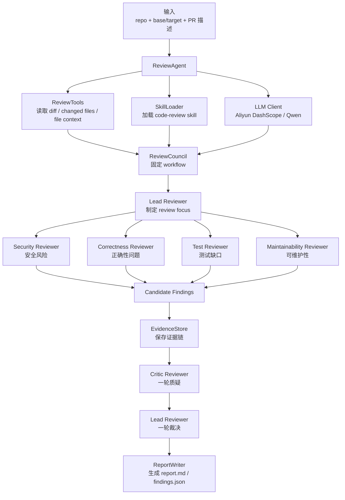
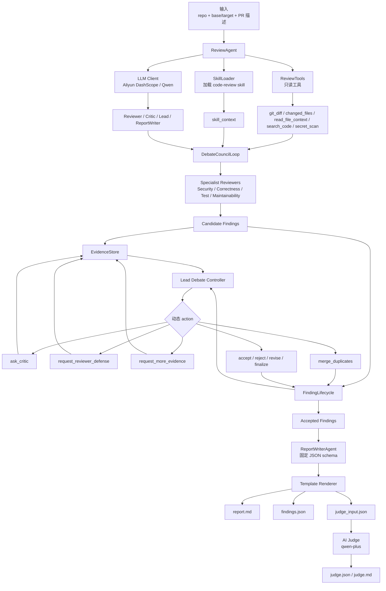

# PR Review Agent Council 中文教程、简历写法与面试问答

这份教程面向第一次接触本项目的中文用户。它会从“这个项目到底做什么”开始，逐步解释默认 `debate` 模式、旧 `council` 模式、Agent 技术点、如何复现、如何写进简历，以及面试时如何回答。

## 1. 项目一句话介绍

这是一个基于 Python + Aliyun DashScope/Qwen 的只读 PR Review Agent。它读取 Git diff 和 PR 描述，组织多个 reviewer 审查代码，再让 critic、lead reviewer 和 report writer 围绕 finding 进行质疑、补证、反驳、合并和裁决，最后生成标准化审查报告。

当前默认模式是 `--mode debate`。旧的 `--mode council` 没有删除，而是作为固定 workflow baseline 保留，方便你向别人解释项目是如何从 council workflow 演进到 debate-style multi-agent system 的。

更适合简历的说法：

> 构建了一个 Debate Council PR Review Agent，通过多 Agent 协作、受控 Tool Calling、Skill Loading、EvidenceStore、FindingLifecycle、结构化输出和 AI Judge 评估，实现对 PR diff 的自动化代码审查与质量评估。

## 2. 为什么不是单纯 workflow

早期 `council` 模式更像固定 workflow：

```text
读取 diff -> 多个 reviewer 审查 -> critic 质疑 -> lead 裁决 -> report
```

这个模式稳定、容易理解，但有一个问题：流程是固定的。每个 finding 基本只经历一轮质疑和裁决，容易出现重复 finding、严重级别夸大、证据不足或某些问题没有被继续追问。

现在默认的 `debate` 模式保留 reviewer 团队覆盖面，但把最关键的 finding 质量控制做成动态 loop：

```text
候选 finding -> Lead 动态选择 action -> critic 质疑 / reviewer 反驳 / 补证 / 合并 / 接收 / 拒绝 -> 标准化报告
```

也就是说，它不是“发现问题越多越好”，而是更关注：

- 是否覆盖关键风险。
- 证据是否足够。
- 严重级别是否准确。
- 是否减少重复和噪音。
- 修复建议是否可执行。
- 报告是否结构化、可复盘。

## 3. 新旧模式流程图

先看旧版 `--mode council`。它是固定委员会流程，优点是稳定、容易理解，缺点是每个 finding 的质疑和裁决轮次比较固定。



再看当前默认 `--mode debate`。它保留 reviewer 分工，但把 finding 的质疑、补证、反驳、合并和裁决做成动态 loop。



## 4. 安装与复现

### 4.1 克隆项目

```bash
git clone https://github.com/csy-csy123/pr-review-agent-council.git
cd pr-review-agent-council
```

### 4.2 创建虚拟环境

Windows PowerShell:

```powershell
python -m venv .venv
.\.venv\Scripts\Activate.ps1
```

macOS / Linux:

```bash
python -m venv .venv
source .venv/bin/activate
```

### 4.3 安装依赖

```bash
python -m pip install -U pip
python -m pip install -r requirements.txt
```

### 4.4 配置 API Key

复制 `.env.example` 为 `.env`：

```text
DASHSCOPE_API_KEY=your_dashscope_api_key
```

程序启动时会读取 `.env` 中的 `DASHSCOPE_API_KEY`。

没有 API key 也可以运行本地降级版本：

```bash
python agents/review_agent.py --repo . --base HEAD~1 --target HEAD --pr-description docs/demo-pr.md --language zh --llm-provider none
```

### 4.5 运行测试

```bash
python -m pytest -p no:cacheprovider
```

## 5. 运行项目

### 5.1 默认 Debate 模式

```bash
python agents/review_agent.py --repo . --base HEAD~1 --target HEAD --pr-description docs/demo-pr.md --language zh
```

默认就是：

```bash
--mode debate
```

### 5.2 旧 Council 模式

```bash
python agents/review_agent.py --repo . --base HEAD~1 --target HEAD --pr-description docs/demo-pr.md --language zh --mode council
```

这个模式用于 baseline 对照。它不是坏设计，而是固定编排版本：reviewer、critic、lead 的顺序更确定，适合教学和效果对比。

### 5.3 Agentic 实验模式

```bash
python agents/review_agent.py --repo . --base HEAD~1 --target HEAD --pr-description docs/demo-pr.md --language zh --mode agentic
```

这个模式更像 ReAct Agent：主 Agent 通过 `next_action()` 动态选择工具和下一步动作。它保留在项目中，用来说明从固定 workflow 到 agentic loop 的演进。

### 5.4 Simple 本地模式

```bash
python agents/review_agent.py --repo . --base HEAD~1 --target HEAD --pr-description docs/demo-pr.md --language zh --mode simple --llm-provider none
```

这个模式适合没有 API key、网络不可用或只想快速演示本地规则时使用。

## 6. 用内置 payment_risk demo 复现

如果当前仓库的 `HEAD~1..HEAD` 不是 demo commit，可以先找到 demo commit：

```bash
git log --format=%H --grep "Demo PR with payment risks" --max-count=1
```

假设输出是 `<demo_commit>`。

运行新 `debate` 模式：

```bash
python agents/review_agent.py --repo . --base <demo_commit>^ --target <demo_commit> --pr-description docs/demo-pr.md --language zh --mode debate
```

运行旧 `council` 模式：

```bash
python agents/review_agent.py --repo . --base <demo_commit>^ --target <demo_commit> --pr-description docs/demo-pr.md --language zh --mode council
```

本地降级运行：

```bash
python agents/review_agent.py --repo . --base <demo_commit>^ --target <demo_commit> --pr-description docs/demo-pr.md --language zh --mode debate --llm-provider none
```

## 7. 输出文件怎么看

运行完成后会生成 `.review-agent/`：

```text
.review-agent/report.md              # 给人看的 Markdown 报告
.review-agent/findings.json          # 结构化 findings
.review-agent/judge_input.json       # 给 AI Judge 的标准化输入
.review-agent/transcript.jsonl       # 完整运行轨迹
.review-agent/judge.json             # AI Judge JSON 评分
.review-agent/judge.md               # AI Judge Markdown 报告
.review-agent/judge-transcript.jsonl # Judge 调用轨迹
```

最建议看的三个文件：

1. `report.md`：最终审查报告。
2. `findings.json`：每个 finding 的字段、状态、证据链。
3. `transcript.jsonl`：Agent 到底做了什么 action。

想确认新模式是否真的发生 debate，可以搜索：

```bash
rg "debate.action|debate.observation|debate.complete" .review-agent/transcript.jsonl
```

## 8. Council 与 Debate 对比

| 维度 | 旧 `council` | 新 `debate` |
|---|---|---|
| 定位 | 固定 workflow baseline | 当前默认模式 |
| Reviewer | 多 reviewer 分工 | 保留多 reviewer 分工 |
| 控制逻辑 | 程序固定执行 | Lead 动态选择 action |
| Critic | 一轮质疑 | 可被多次调用 |
| Reviewer defense | 不突出 | 支持 reviewer 反驳、补证、修改 |
| 重复 finding | 容易保留重复 | 支持 merge duplicates |
| 报告 | 程序模板化输出 | ReportWriterAgent 生成固定 JSON，再模板化输出 |
| 评估方式 | 看报告和 findings | 可进一步用 AI Judge 按 rubric 评分 |

一句话理解：

```text
council = 固定委员会流程。
debate = 委员会仍在，但 finding 的质疑、补证、去重和裁决由 Agent 动态控制。
```

## 9. Demo 审查质量对比

这里的“性能对比”更准确地说是“审查质量对比”，不是运行速度对比。因为这个项目的目标不是更快跑完，而是让 PR review 的结果更可靠、更少重复、更有证据、更可执行。

对比方式：

```text
同一段 payment_risk.py demo
同一个 PR 描述 docs/demo-pr.md
同一组 base/target diff
分别运行 --mode council 和 --mode debate
再用同一个 qwen-plus AI Judge 读取标准化 judge_input.json 打分
```

总体结果：

| 指标 | 旧 `council` | 新 `debate` | 变化 |
|---|---:|---:|---:|
| AI Judge 总分 | 72 | 92 | +20 |
| 原始候选 findings | 19 | 21 | +2 |
| 原始 accepted findings | 16 | 19 | +3 |
| 标准报告 accepted | 12 | 11 | -1 |
| 标准报告 rejected | 1 | 2 | +1 |
| 标准报告 downgraded | 4 | 1 | -3 |

注意这里不能简单理解成“accepted 越多越好”。新版 `debate` 的标准报告 accepted 数量略少，但总分更高，原因是它更重视去重、证据和严重级别校准。

AI Judge 维度分：

| 维度 | 旧 `council` | 新 `debate` | 改进点 |
|---|---:|---:|---|
| critical issue coverage | 100 | 100 | 两者都覆盖了关键风险 |
| evidence quality | 85 | 95 | debate 补充和保留了更强证据链 |
| severity accuracy | 70 | 90 | debate 对严重级别判断更稳 |
| duplicate/noise control | 40 | 98 | debate 明显减少重复 finding |
| actionability | 90 | 96 | debate 的修复建议更聚焦 |
| report clarity | 80 | 85 | 标准化报告更清晰 |

这组结果最值得讲的不是总分，而是 `duplicate/noise control` 从 40 提升到 98。旧 `council` 模式里，多个 reviewer 容易对同一个 SQL injection 或 mutable default argument 重复提出 finding；新 `debate` 模式会通过 `merge_duplicates`、`reject_finding`、`request_more_evidence` 等 action，把重复或证据不足的问题压下去。

可以这样总结：

```text
旧 council 的优势是覆盖稳定，但容易重复。
新 debate 的优势是质量控制更强，能围绕 finding 做质疑、补证、去重和裁决。
AI Judge 分数从 72 到 92，主要提升来自证据质量、severity accuracy 和 duplicate/noise control。
```

面试中不要说“AI Judge 证明新版一定更好”，而应该说：

> 在相同 demo、相同 diff、相同 rubric 下，AI Judge 给 debate 更高评分，说明它在这个样本上表现出更好的证据质量、严重级别判断和去噪能力。这个结果是一个自动化评估信号，还需要结合人工 review 和更多样本验证。

项目中也保留了脱敏后的示例输出：

```text
docs/demo-results/council-report.md
docs/demo-results/council-judge.md
docs/demo-results/council-judge.json
docs/demo-results/debate-report.md
docs/demo-results/debate-judge.md
docs/demo-results/debate-judge.json
```

## 10. AI Judge 怎么用

先运行 review，生成：

```text
.review-agent/judge_input.json
```

再执行：

```bash
python agents/review_agent.py --judge-report .review-agent/judge_input.json --repo . --base HEAD~1 --target HEAD --pr-description docs/demo-pr.md
```

默认 judge model：

```text
qwen-plus
```

AI Judge 的 rubric：

- critical issue coverage：关键问题覆盖。
- evidence quality：证据质量。
- severity accuracy：严重级别是否准确。
- duplicate/noise control：重复和噪音控制。
- actionability：修复建议是否可执行。
- report clarity：报告结构是否清晰。

注意：AI Judge 不是绝对真理。它是 evaluation proxy，用于固定输入、固定 rubric、固定模型下比较不同 agent 策略。严谨评估还需要人工标注、多次采样、多模型投票和真实 PR 反馈。

## 11. 核心代码结构

```text
agents/review_agent.py
```

这是主文件，包含：

- CLI 参数解析。
- `ReviewAgent` 主入口。
- `ReviewTools` 只读工具。
- `AliyunDashScopeClient` LLM client。
- `ReviewCouncil` 旧 council baseline。
- `AgenticReviewLoop` 全局 ReAct 实验模式。
- `DebateCouncilLoop` 默认 debate 模式。
- `ReportWriterAgent` 标准化报告 agent。
- `JudgeRunner` AI Judge。
- `Transcript` JSONL 轨迹记录。

```text
skills/code-review/SKILL.md
```

这是 skill 文件，作用类似“项目内置审查指南”。它会被加载为 `skill_context`，注入 reviewer、critic、lead、report writer 的 prompt。

```text
tests/test_review_agent.py
```

测试文件，覆盖：

- fake LLM 驱动 debate action。
- critic challenge 后 reviewer defense。
- duplicate finding merge/reject。
- ReportWriterAgent 固定 JSON schema。
- AI Judge 读取 `judge_input.json` 并生成评分。
- `debate`、`council`、`agentic`、`simple` 兼容。

## 12. 这个项目真实用了哪些 Agent 技术

### 12.1 Tool Calling

Agent 不是直接随便读写系统，而是通过受控工具观察仓库：

- `git_diff`
- `changed_files`
- `read_file_context`
- `search_code`
- `secret_scan`
- `run_tests`

其中 `run_tests` 只有用户传入 `--test-command` 时才允许调用，避免 Agent 私自运行不受控命令。

### 12.2 Skill Loading

`SkillLoader` 会读取：

```text
skills/code-review/SKILL.md
```

然后把审查标准、severity 定义、finding schema 注入 prompt。这对应 Claude Code/Codex 里常见的 skill 或 instruction loading 思想。

### 12.3 Multi-Agent System

项目里有多个角色：

- Security Reviewer
- Correctness Reviewer
- Test Reviewer
- Maintainability Reviewer
- Critic Reviewer
- Lead Debate Controller
- ReportWriterAgent
- AI Judge

它们不是同一个 prompt 换名字，而是职责不同、输入输出不同、在流程中的位置也不同。

### 12.4 Debate Loop

`DebateCouncilLoop` 支持这些 action：

- `ask_critic`
- `request_reviewer_defense`
- `request_more_evidence`
- `revise_finding`
- `merge_duplicates`
- `accept_finding`
- `reject_finding`
- `ask_report_writer`
- `finalize`

这就是项目从 workflow 升级为 agentic multi-agent debate 的核心。

### 12.5 FindingLifecycle

每个 finding 有生命周期：

```text
candidate -> challenged -> accepted / rejected / downgraded
```

这样可以追踪一个问题从提出、被质疑、补证、被接受或拒绝的全过程。

### 12.6 EvidenceStore

每个 finding 不只是一句话，还会绑定：

- reviewer explanation
- diff line
- file context
- critic challenge
- reviewer defense
- lead resolution

这让报告更像真正 code review，而不是泛泛而谈。

### 12.7 Structured Output

LLM 不能自由发挥输出长篇 Markdown。项目要求：

- finding 用 JSON。
- debate action 用 JSON。
- report writer 用固定 JSON schema。
- judge 用固定 JSON rubric。

程序负责解析、校验和模板渲染。

### 12.8 Transcript Observability

每一步都会写入：

```text
.review-agent/transcript.jsonl
```

这对调试和面试都很重要。你可以说：我不是只看最终结果，还保留了 agent action、observation 和 resolution 的可观测链路。

## 13. ReportWriterAgent 为什么要标准化

如果直接让 LLM 写 Markdown，AI Judge 可能被文笔影响。为避免这种情况，ReportWriterAgent 只能输出固定 JSON：

```text
verdict
summary_points
accepted_findings
rejected_findings
downgraded_findings
duplicate_notes
critic_notes
```

每个 accepted finding 也有固定字段：

```text
issue
severity
file
line
evidence
impact
fix
why_accepted
critic_notes
```

Markdown 是程序按模板生成的。这让不同模式的报告更容易公平比较。

## 14. 如果被问：AI Judge 凭什么有效

这个问题也可以理解为：一次 LLM 调用凭什么评价一个 Agent 系统？

推荐回答：

> AI Judge 不能证明系统绝对有效，它不是 ground truth，而是 evaluation proxy。我的设计是让 Judge 读取标准化 `judge_input.json`，不是漂亮 Markdown，再用固定 rubric 评价 coverage、evidence、severity、noise、actionability 和 clarity。这样可以给不同 agent 策略提供同一把尺子下的相对比较。为了降低偏差，系统保留 judge_input、judge output 和 transcript。更严格的评估还可以加入人工标注集、多次采样、多模型投票和真实 PR 反馈闭环。

## 15. 简历写法

简历里不要只写“调用大模型做代码审查”。这样会显得像 API demo。更好的写法是突出：多 Agent 协作、动态决策、工具调用、结构化输出、证据链、可观测性和评估闭环。

### 项目名称

```text
Debate Council PR Review Agent：基于 Qwen 的多 Agent 代码审查与评估系统
```

### 一句话版

> 基于 Python 与 Aliyun DashScope/Qwen 构建 Debate Council PR Review Agent，将固定 council workflow 升级为动态多 Agent debate loop，实现 PR diff 审查、证据链追踪、结构化报告生成和 AI Judge 质量评估。

### 项目经历版

> 设计并实现 Debate Council PR Review Agent，基于 Python 接入 Aliyun DashScope/Qwen，将 PR diff 审查拆分为 Security、Correctness、Test、Maintainability Reviewer、Critic Reviewer、Lead Debate Controller、ReportWriterAgent 和 AI Judge 等角色；通过只读 Tool Calling 获取 git diff、变更文件、代码上下文、代码搜索结果和受控测试输出，并使用 Skill Loading 注入 code-review 规范与 finding schema。

### STAR 版

> 面向传统 PR review 覆盖不稳定、LLM 直接审查容易产生重复和误报的问题，设计多 Agent Debate Council 架构：先由专业 reviewer 生成候选 finding，再由 Lead Debate Controller 动态触发 critic challenge、reviewer defense、补充证据、合并重复项和最终裁决；最终将审查结果标准化为 `report.md`、`findings.json`、`judge_input.json` 和 JSONL transcript，形成可复现、可评估、可复盘的 Agent 审查流程。

### Agent 技术版

> 参考 learn-claude-code / Claude Code 风格的 Agent 工程思想，实现受控 Tool Calling、Skill Loading、Multi-Agent Debate、FindingLifecycle、EvidenceStore、Structured Output 和 Transcript Observability；其中 Lead Debate Controller 支持 `ask_critic`、`request_reviewer_defense`、`request_more_evidence`、`merge_duplicates`、`accept_finding`、`reject_finding` 等动态 action，使系统从固定 workflow 演进为围绕 finding 质量控制的 agentic loop。

### 工程能力版

> 通过 JSON schema 约束 reviewer、debate action、report writer 和 judge 输出，降低 LLM 自由生成带来的解析失败和幻觉风险；通过 EvidenceStore 将 finding 与 diff line、file context、critic notes、lead resolution 绑定，并用 JSONL transcript 记录完整 action/observation 链路，提升系统的可解释性、调试效率和回归测试能力。

### 评估优化版

> 设计 ReportWriterAgent 固定 JSON schema，最终 Markdown 由程序模板渲染，减少文笔差异对评估结果的影响；构建基于 `judge_input.json` 的 AI Judge 评估流程，使用 qwen-plus 按 critical issue coverage、evidence quality、severity accuracy、duplicate/noise control、actionability 和 report clarity 对不同 Agent 策略进行相对评分，用于 prompt 和 agent 编排策略迭代。

### 更适合中文简历的三条项目描述

- 设计多 Agent PR Review 架构，将代码审查拆分为专业 reviewer、critic、lead controller、report writer 和 judge 等角色，并通过 MessageBus、EvidenceStore 和 FindingLifecycle 管理 finding 的提出、质疑、补证、合并和裁决过程。
- 实现受控只读 Tool Calling，包括 `git_diff`、`changed_files`、`read_file_context`、`search_code`、`secret_scan` 和受控 `run_tests`，并结合 Skill Loading 将审查规范、severity 标准和 finding schema 注入多角色 prompt。
- 构建标准化报告与评估链路，使用 ReportWriterAgent 输出固定 JSON，再由程序模板生成 Markdown；引入 AI Judge 基于 `judge_input.json` 对 coverage、evidence、severity、noise 和 actionability 做相对评分。

### 关键词

```text
Python, Aliyun DashScope, Qwen, LLM Agent, Multi-Agent System, Debate Loop, Tool Calling, Skill Loading, Structured Output, JSON Schema, EvidenceStore, FindingLifecycle, Critic Agent, ReportWriterAgent, AI Judge, JSONL Transcript, Git Diff Analysis, pytest
```

### 英文版

> Built a Debate Council PR Review Agent with Python and Aliyun DashScope/Qwen, upgrading a fixed council workflow into a dynamic multi-agent debate loop with controlled read-only tool calling, skill loading, evidence tracking, finding lifecycle management, structured JSON outputs, transcript observability, standardized report generation, and AI Judge based evaluation.

## 16. 面试问答

### Q1：这个项目和普通 workflow 最大区别是什么？

A：普通 workflow 是程序固定执行步骤。我的 `debate` 模式保留 reviewer 团队，但让 Lead Debate Controller 根据当前 finding、证据链和 critic 反馈动态选择 action，比如质疑、补证、让 reviewer 反驳、合并重复项、接受或拒绝 finding。

### Q2：为什么不让一个大模型直接 review？

A：单 Agent 容易视角单一，也容易漏掉某类问题。多 reviewer 分工可以保证覆盖面，critic 和 lead 再负责质量控制。这样更接近真实 code review：有人提出问题，有人质疑证据，有人做最终裁决。

### Q3：为什么现在默认是 debate，不是 agentic？

A：全局 ReAct agentic loop 很动态，但在 PR review 场景里可能覆盖不稳定。PR review 的关键不是每一步都动态，而是 finding 的质量控制要动态。所以我保留 council 的 reviewer 覆盖，用 debate loop 处理质疑、补证、去重和裁决。

### Q4：ReportWriterAgent 有什么价值？

A：它把最终报告约束为固定 JSON schema，再由程序渲染 Markdown。这样可以减少文笔、排版和模型表达风格对 AI Judge 的影响，也让报告更稳定、更适合自动化评估。

### Q5：AI Judge 是不是不可靠？

A：它不是绝对可靠，也不是 ground truth。它是辅助评价指标，用固定输入和固定 rubric 做相对比较。项目保留 `judge_input.json`、`judge.json` 和 transcript，保证评分过程可追踪。真实工程里还应结合人工标注和线上反馈。

### Q6：项目如何避免 LLM 胡说？

A：第一，所有输出要求 JSON schema。第二，finding 会经过字段校验。第三，finding 必须绑定 diff line 和 file context。第四，critic 会检查证据和严重级别。第五，lead 会做最终 resolution。第六，所有过程写入 transcript，可以复盘。

### Q7：有没有真的调用大模型？

A：有。`--llm-provider aliyun` 时会调用 Aliyun DashScope 的 OpenAI-compatible chat completions API。review 默认模型是 `qwen-turbo-latest`，AI Judge 默认模型是 `qwen-plus`。没有 API key 或网络失败时会 fallback，不阻断本地 demo。

### Q8：为什么还要保留旧 council 模式？

A：旧 council 是 baseline。它能稳定展示多 reviewer、critic、lead reviewer 的基本协作方式，也方便和新 debate 模式做效果对比。如果直接删除旧模式，就很难说明新模式到底改进了什么。保留它可以清楚展示项目从固定 workflow 到动态 debate loop 的演进。

### Q9：Debate Loop 具体动态在哪里？

A：动态体现在 Lead Debate Controller 每轮会根据当前 finding、证据链、critic 反馈和已有 resolution 选择下一步 action。它可能要求 critic 质疑，也可能让 reviewer defense，或者补充上下文、合并重复项、修改 finding、接受或拒绝问题，而不是按固定顺序走完流程。

### Q10：这个项目用了哪些类似 Claude Code / Codex 的思想？

A：主要是受控工具调用、skill/instruction loading、todo/lifecycle 管理、结构化 action、transcript 可观测性和 agent loop。项目没有复制 Claude Code 内部实现，但借鉴了“模型负责决策，程序负责执行受控工具并记录 observation”的工程范式。

### Q11：Tool Calling 在这个项目里怎么体现？

A：Agent 不直接访问任意系统能力，而是通过 `ReviewTools` 提供的只读工具观察仓库，比如读取 diff、列 changed files、读文件上下文、搜索代码、扫描疑似 secret、受控运行测试。这样可以把 LLM 的能力限制在安全边界内，同时保留足够上下文。

### Q12：Skill Loading 有什么用？

A：`skills/code-review/SKILL.md` 相当于项目内置审查手册，包含审查关注点、severity 标准和 finding schema。加载后会作为 `skill_context` 注入 reviewer、critic、lead 和 report writer 的 prompt，避免每个 agent 都靠临时 prompt 猜审查标准。

### Q13：Critic Reviewer 和 Lead Reviewer 有什么区别？

A：Critic Reviewer 的职责是反向验证 finding 是否证据充分、是否夸大、是否重复、是否和 diff 相关。Lead Reviewer 或 Lead Debate Controller 的职责是做决策：根据 reviewer 提案、critic 反馈和证据链决定下一步 action 或最终 resolution。

### Q14：为什么要做 EvidenceStore？

A：如果只有 finding 文本，就很难判断问题是不是模型臆测。EvidenceStore 会把 finding 和 reviewer explanation、diff line、file context、critic challenge、reviewer defense、lead resolution 绑定起来，让每个结论都有证据链，也方便之后复盘。

### Q15：FindingLifecycle 解决了什么问题？

A：它让 finding 不再是“一生成就进入报告”。一个 finding 会经历 candidate、challenged、accepted、rejected、downgraded 等状态。这样可以表达“这个问题被质疑过、补过证、被合并或被降级”，更接近真实 code review。

### Q16：为什么 ReportWriterAgent 不直接写 Markdown？

A：直接写 Markdown 会让报告质量受文笔影响，也会影响 AI Judge 评分公平性。所以 ReportWriterAgent 只输出固定 JSON schema，程序再按模板生成 Markdown。这样报告结构稳定，也更适合自动化比较不同模式。

### Q17：AI Judge 为什么不是伪指标？

A：它确实不是最终真理，也不能代替人工评审。但它不是随便问一句“哪个好”，而是读取标准化 `judge_input.json`，按固定 rubric 评价 coverage、evidence、severity、noise、actionability 和 clarity。它的价值是做相对比较和回归评估，而不是证明系统绝对正确。

### Q18：如何评价新 debate 模式比旧 council 好？

A：不应该只看 finding 数量。更合理的是看关键风险是否覆盖、证据是否更充分、重复项是否减少、severity 是否更准确、报告是否更可执行。项目里用标准化 report 和 AI Judge rubric 做相对比较，也保留 transcript 让人可以人工复核。

### Q19：如果 LLM 输出不是合法 JSON 怎么办？

A：代码里会要求模型返回 JSON，并在解析时处理 markdown fence、字段缺失和异常情况。解析失败时会记录 transcript，并 fallback 到本地 guardrails 或保守输出。这样系统不会因为一次 LLM 格式错误完全中断。

### Q20：这个项目当前最大的局限是什么？

A：第一，真实项目里还需要更强的跨文件理解和依赖分析，可以接 AST、Semgrep 或代码索引。第二，AI Judge 只是 proxy metric，需要结合人工标注和真实 PR 反馈。第三，多 Agent 调用会增加 token 成本和延迟，需要做批量化、缓存和更精细的 prompt 裁剪。

### Q21：如果继续优化，你会做什么？

A：我会优先做三件事：第一，让 duplicate merge 更稳定，减少重复 debate action；第二，把 critic 和 lead resolution 做成批量处理，降低调用成本；第三，引入静态分析工具和小规模人工标注集，用来校准 AI Judge 和 severity 判断。

## 17. 推荐学习顺序

1. 先跑 `--llm-provider none`，理解本地降级流程。
2. 再配置 `.env`，跑默认 `--mode debate`。
3. 打开 `.review-agent/report.md` 看最终报告。
4. 打开 `.review-agent/transcript.jsonl` 搜索 `debate.action`。
5. 再跑 `--mode council`，比较旧模式。
6. 最后运行 AI Judge，理解为什么不用 finding 数量作为唯一指标。
